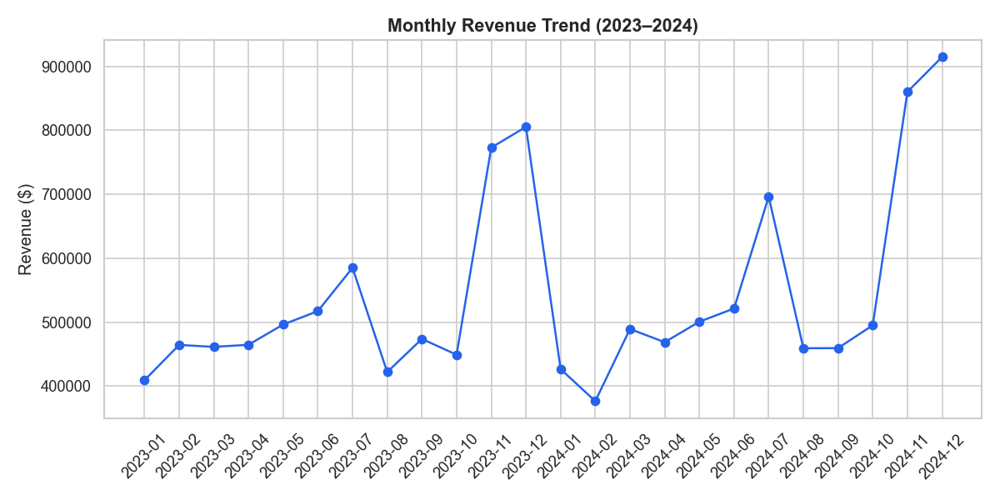
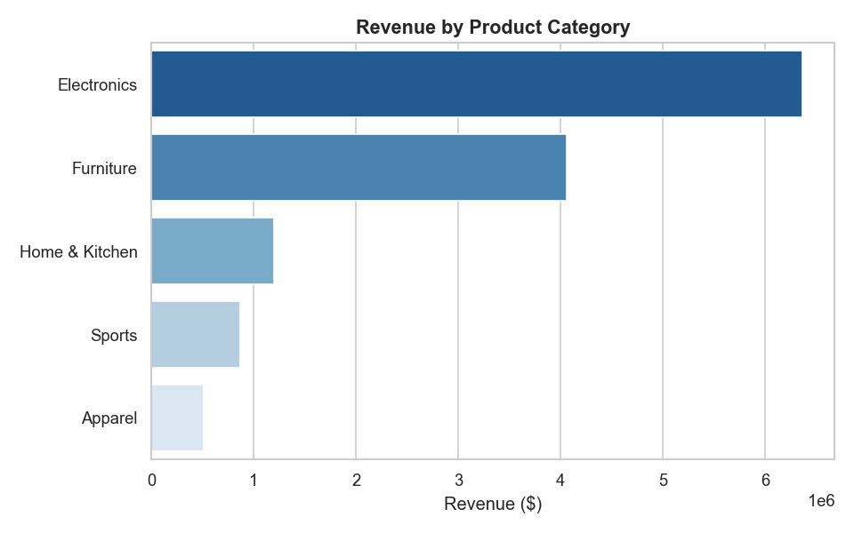
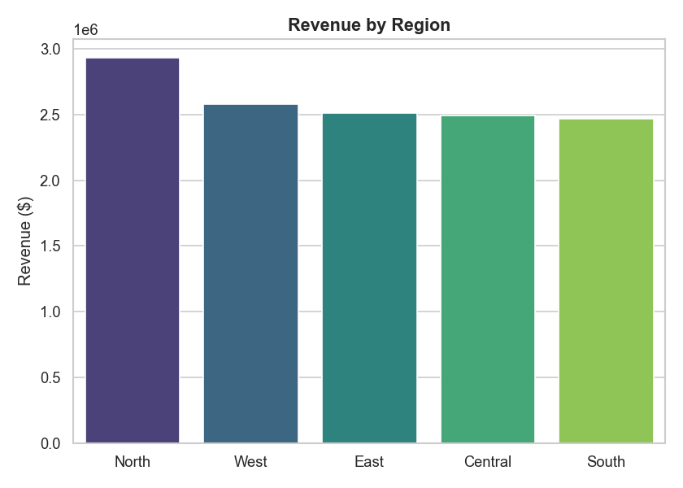
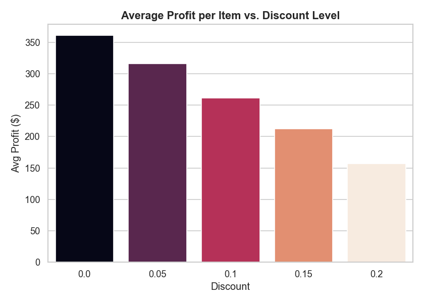
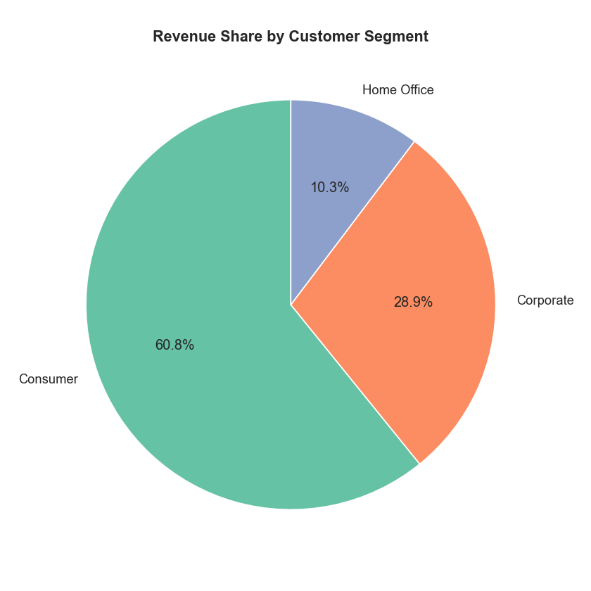
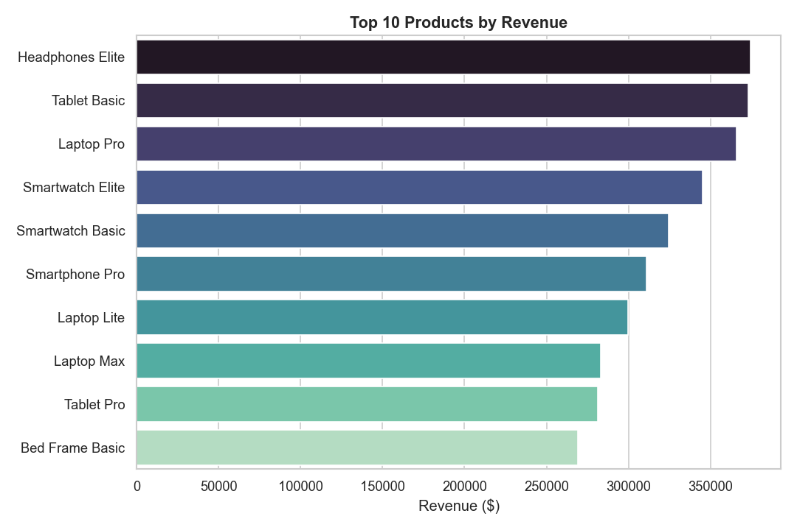

# 📊 Retail Sales Analytics — End-to-End Data Analyst Project

An end-to-end data analytics project that simulates a real retail business scenario: cleaning and modeling transactional data, writing business-focused SQL queries, performing exploratory data analysis in Python, and translating findings into actionable recommendations.

**Skills demonstrated:** SQL (joins, CTEs, window functions) · Python (pandas, matplotlib, seaborn) · Data modeling · Business analysis · Data storytelling

---

## 📌 Business Problem

A retail company wants to understand:
- Where and when is revenue being generated?
- Which products, categories, and regions drive the most profit?
- Is our discounting strategy helping or hurting margins?
- Who are our most valuable customers, and who's at risk of churning?

This project answers those questions using a realistic 2-year dataset of orders, customers, and products.

---

## 🗂️ Dataset

Since real company data isn't publicly shareable, this project uses a **programmatically generated, internally-consistent synthetic dataset** (`scripts/generate_data.py`) modeled on real-world retail data (similar structure to the well-known Superstore dataset). It includes realistic seasonality (Nov/Dec holiday spike), discount tiers, shipping modes, and customer segments — so the analysis and insights are genuine, not hardcoded.

| Table | Rows | Description |
|---|---|---|
| `customers.csv` | 1,200 | Customer demographics, segment, region, signup date |
| `products.csv` | 150 | Product catalog across 5 categories, pricing & cost |
| `orders.csv` | 8,000 | Order-level info: dates, shipping mode, total |
| `order_items.csv` | 14,010 | Line-item detail: quantity, discount, net sales, profit |

---

## 🧱 Project Structure

```
retail-sales-analytics/
├── data/
│   ├── customers.csv
│   ├── products.csv
│   ├── orders.csv
│   ├── order_items.csv
│   └── retail.db                  # SQLite database (built from CSVs)
├── sql/
│   └── business_analysis.sql      # 12 business-question SQL queries
├── notebooks/
│   └── retail_sales_eda.ipynb     # Full EDA notebook with insights
├── scripts/
│   ├── generate_data.py           # Synthetic data generator
│   ├── build_database.py          # Loads CSVs into SQLite
│   └── eda_analysis.py            # Standalone script that outputs charts
├── visuals/                        # Exported PNG charts
├── requirements.txt
└── README.md
```

---

## ⚙️ How to Run

```bash
# 1. Clone the repo
git clone https://github.com/<your-username>/retail-sales-analytics.git
cd retail-sales-analytics

# 2. Install dependencies
pip install -r requirements.txt

# 3. Generate the dataset
python3 scripts/generate_data.py

# 4. Build the SQLite database
python3 scripts/build_database.py

# 5. Run the EDA script (exports charts to /visuals)
python3 scripts/eda_analysis.py

# 6. Or explore interactively
jupyter notebook notebooks/retail_sales_eda.ipynb
```

You can also query `data/retail.db` directly with any SQL client, or run the queries in `sql/business_analysis.sql`.

---

## 🔍 Key Insights

**Overall: $12.99M revenue · $4.38M profit · 33.7% profit margin**

### 1. Revenue has strong seasonality
Clear spikes in **November–December** (holiday shopping) and a smaller lift in June–July, with a dip in the early months of each year.



### 2. Electronics drives the most revenue
**Electronics** is the top category ($6.36M), roughly double the next-closest category — a strong signal for inventory and marketing prioritization.



### 3. Regional performance is uneven
The **North** region leads in total revenue ($2.93M) — worth investigating what's driving outperformance and whether it's replicable in lagging regions.



### 4. Deep discounts erode profit fast
Average profit per line item drops sharply once discounts exceed ~15%, with the highest discount tier operating close to break-even.



### 5. Consumer segment drives volume, Corporate drives value
The Consumer segment contributes the largest revenue share by volume, but Corporate customers show the highest revenue-per-customer — a classic volume-vs-value tradeoff.



### 6. Revenue is concentrated in a handful of products
The top 10 products account for a disproportionate share of total revenue — a classic 80/20 pattern worth watching for supply-chain risk.



---

## 💡 Business Recommendations

1. **Plan inventory & ad spend around the Nov/Dec surge** — the seasonality is consistent and predictable.
2. **Cap or restructure discounts above 15%** — they barely break even at the unit-profit level; consider bundling instead of blanket discounting.
3. **Investigate what's driving North region's outperformance** and test replicating it in underperforming regions.
4. **Run a win-back campaign** targeting customers with long recency gaps (identified via the churn-risk SQL query).
5. **Build a dedicated Corporate segment strategy** — fewer customers, but significantly higher value per customer.

---

## 🧠 SQL Highlights

The `sql/business_analysis.sql` file includes 12 real business questions, including:
- Month-over-month revenue growth using `LAG()` window functions
- RFM-style recency analysis using CTEs to flag churn-risk customers
- New vs. repeat customer revenue split by month
- Discount-tier profitability breakdown

---

## 🛠️ Tech Stack

- **Python**: pandas, numpy, matplotlib, seaborn, Faker
- **SQL**: SQLite (ANSI-compatible — queries port easily to PostgreSQL/MySQL)
- **Jupyter Notebook** for exploratory analysis and storytelling

---

## 📈 Possible Extensions

- Build an interactive Power BI / Tableau dashboard on top of `retail.db`
- Add a Streamlit app for live filtering by region/category/date
- Layer in a customer churn prediction model (logistic regression / XGBoost)
- Automate the pipeline with Airflow for a "daily refresh" simulation

---

## 👤 Author

Shobhana — Aspiring Data Analyst
[LinkedIn](https://www.linkedin.com/in/shobhana82) · [Portfolio](https://yourusername.github.io) · [Email](mailto:shobhana8210@gmail.com)

